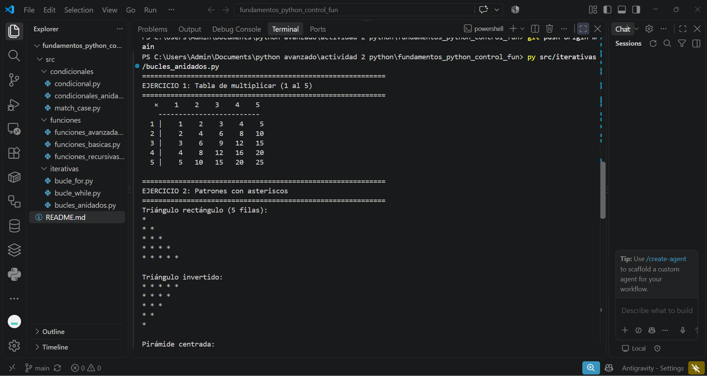
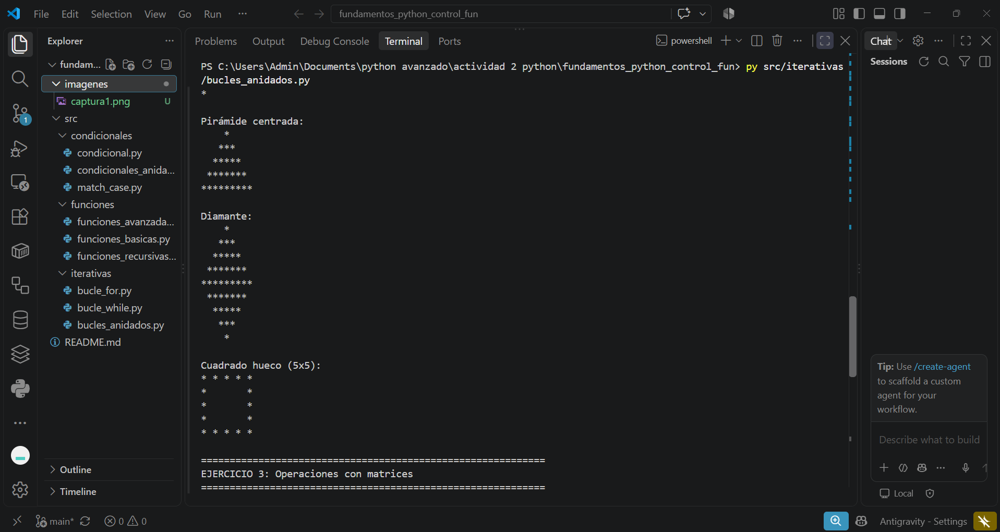
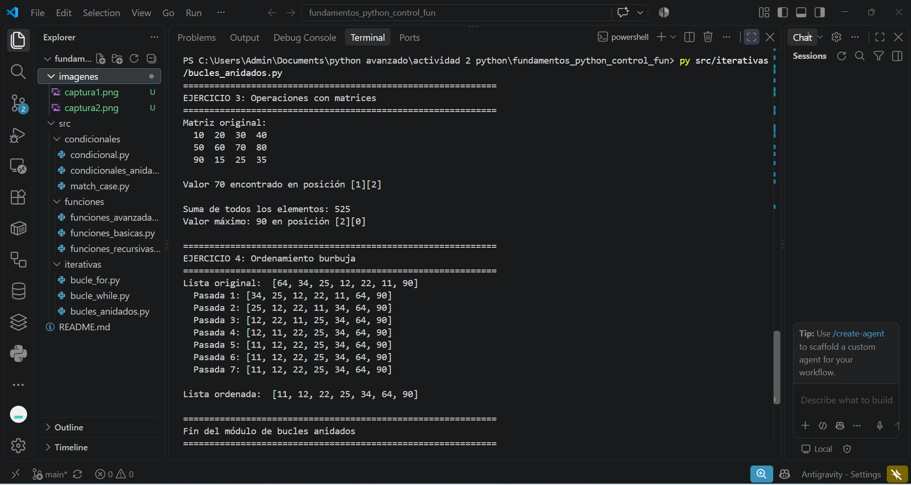

# GA1-220501093-04-AA1-EV02 – Fundamentos de Python: Estructuras de Control y Funciones

## Descripción del Proyecto

Este proyecto contiene ejercicios prácticos que demuestran el uso de las estructuras de control y funciones en Python. Se cubren los tres pilares fundamentales de la programación estructurada:

1. **Estructuras condicionales**: if/elif/else, operadores lógicos, condicionales anidados, operador ternario y match/case.
2. **Estructuras iterativas**: bucle for (con range, enumerate, zip, comprehensions), bucle while (contadores, acumuladores, centinelas), bucles anidados y control de flujo (break/continue).
3. **Funciones**: definición con docstrings, parámetros (posicionales, keyword, default), retorno múltiple, scope de variables, *args/**kwargs, funciones lambda, higher-order functions, map/filter/reduce y recursividad.

**Autor:** Simón Carmona  
**Programa:** Tecnólogo en Análisis y Desarrollo de Software  
**Competencia:** 220501093 – Evaluar requisitos de la solución de software  
**Resultado de aprendizaje:** 220501093-04

---

## Estructura del Proyecto

```
fundamentos_python_control_fun/
├── src/
│   ├── condicionales/
│   │   ├── condicional.py              # if/elif/else, operadores lógicos, ternario
│   │   ├── condicionales_anidados.py   # Condicionales dentro de condicionales
│   │   └── match_case.py              # Structural pattern matching (Python 3.10+)
│   ├── iterativas/
│   │   ├── bucle_for.py               # for con range, enumerate, zip, comprehensions
│   │   ├── bucle_while.py             # while, centinelas, menús, validación
│   │   └── bucles_anidados.py         # Tablas, patrones, matrices, bubble sort
│   └── funciones/
│       ├── funciones_basicas.py       # Docstrings, parámetros, retorno, scope
│       ├── funciones_avanzadas.py     # *args, **kwargs, lambda, map/filter/reduce
│       └── funciones_recursivas.py    # Factorial, Fibonacci, búsqueda binaria
└── README.md
```

---

## Ejecución de los Ejercicios

Para ejecutar los scripts, abre una terminal en la ruta principal del proyecto (`fundamentos_python_control_fun/`) y corre los siguientes comandos:

### Condicionales

```bash
# Condicionales básicas: if/elif/else, operadores lógicos, ternario, comparaciones
python src/condicionales/condicional.py

# Condicionales anidados: menús, validación, descuentos, IMC
python src/condicionales/condicionales_anidados.py

# Match/Case: pattern matching con tuplas, diccionarios y tipos
python src/condicionales/match_case.py
```

### Iterativas

```bash
# Bucle for: range, colecciones, enumerate, zip, list comprehension, break/continue
python src/iterativas/bucle_for.py

# Bucle while: contadores, acumuladores, centinelas, menús, algoritmos clásicos
python src/iterativas/bucle_while.py

# Bucles anidados: tabla de multiplicar, patrones ASCII, matrices, bubble sort
python src/iterativas/bucles_anidados.py
```

### Funciones

```bash
# Funciones básicas: docstrings, parámetros, valores default, retorno múltiple, scope
python src/funciones/funciones_basicas.py

# Funciones avanzadas: *args, **kwargs, lambda, higher-order, map/filter/reduce
python src/funciones/funciones_avanzadas.py

# Funciones recursivas: factorial, Fibonacci, suma de dígitos, búsqueda binaria
python src/funciones/funciones_recursivas.py
```

---

## Temas Cubiertos por Archivo

### 📂 Condicionales

| Archivo | Temas |
|---------|-------|
| `condicional.py` | if/elif/else, operadores lógicos (and, or, not), verificación par/impar, operador ternario, comparaciones encadenadas, verificación de vocales, tipos de triángulo |
| `condicionales_anidados.py` | Menú con sub-opciones, validación escalonada de registro, calculadora de descuentos por tipo de cliente, clasificador de IMC con subcategorías |
| `match_case.py` | Match/case básico, agrupación con `\|`, destructuración de tuplas con guards, coincidencia de diccionarios, coincidencia por tipos de datos |

### 📂 Iterativas

| Archivo | Temas |
|---------|-------|
| `bucle_for.py` | range() (start, stop, step), iteración sobre listas/tuplas/strings, enumerate(), zip(), list comprehension con filtros, break, continue, for...else |
| `bucle_while.py` | Contadores, acumuladores, factorial iterativo, condición centinela, while True con menú interactivo, validación de entrada, algoritmo de Euclides (MCD), inversión de número, conversión decimal a binario |
| `bucles_anidados.py` | Tabla de multiplicar, patrones ASCII (triángulo, pirámide, diamante, cuadrado hueco), búsqueda y operaciones en matrices, algoritmo de ordenamiento burbuja |

### 📂 Funciones

| Archivo | Temas |
|---------|-------|
| `funciones_basicas.py` | Docstrings completas (Args, Returns, Raises, Examples), parámetros posicionales vs keyword, valores por defecto, retorno múltiple con tuplas, scope local vs global, shadowing |
| `funciones_avanzadas.py` | *args (argumentos variables), **kwargs (keyword arguments variables), funciones lambda, sorted() con key lambda, funciones de orden superior, closures, map(), filter(), reduce() |
| `funciones_recursivas.py` | Factorial recursivo, secuencia de Fibonacci, suma de dígitos, potencia recursiva, búsqueda binaria recursiva, comparación recursión vs iteración |

---

## Requisitos

- Python 3.10 o superior (requerido para match/case en `match_case.py`)
- No se requieren bibliotecas externas; todos los scripts usan solo la biblioteca estándar de Python

---

## Reflexión del Aprendizaje

A lo largo de este proyecto pude reforzar y profundizar en los conceptos fundamentales de la programación estructurada en Python:

- **Condicionales**: Aprendí que más allá del if/else básico, Python ofrece herramientas poderosas como el operador ternario para decisiones en línea y el match/case para coincidencia de patrones, que hacen el código más legible y expresivo.

- **Iterativas**: Comprendí la diferencia entre usar `for` (cuando se conoce la cantidad de iteraciones) y `while` (cuando depende de una condición). Funciones como `enumerate()` y `zip()` simplifican enormemente el trabajo con colecciones, y las list comprehensions son una forma pythónica y eficiente de crear listas.

- **Funciones**: Entendí la importancia de documentar funciones con docstrings, cómo usar parámetros flexibles (*args, **kwargs), y que las funciones en Python son ciudadanos de primera clase (se pueden pasar como argumentos). La recursividad me enseñó a pensar en problemas de forma diferente, descomponiéndolos en subproblemas más simples.

- **Buenas prácticas**: Cada archivo incluye comentarios explicativos, docstrings con formato estándar, y separación clara entre ejercicios, lo que facilita la lectura y mantenimiento del código.
---

## Evidencia de Ejecución

A continuación, se presentan algunas capturas de pantalla que demuestran la correcta ejecución de los scripts desarrollados en los diferentes módulos:

### 1. Captura de Ejecución 1


### 2. Captura de Ejecución 2


### 3. Captura de Ejecución 3

